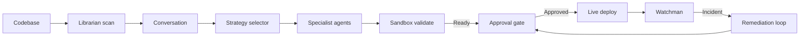

# FORGE

FORGE is the AI DevOps engineer that lives in your terminal. Point it at any
project and it will write the Dockerfile, the Kubernetes manifests, the CI/CD
pipeline, and watch the deployment afterwards — with explicit safety gates and
a tamper-evident audit trail.

## Install

```bash
curl -fsSL https://raw.githubusercontent.com/Henildiyora/forge/main/install.sh | bash
```

This installs FORGE globally with `pipx`. No Python virtual environment to
manage. No API keys required.

## Quick start

```bash
cd my-project
forge index
forge build
```

That's it. FORGE scans the project, asks one or two clarifying questions if it
needs them, picks a deployment strategy, and writes the artifacts into
`.forge/generated/`. Heuristic backend by default — works fully offline.

> **30-second demo:** [`docs/demo.cast`](docs/demo.cast) (record locally with
> `scripts/record-demo.sh`, then upload to asciinema or embed as SVG).

## Even better: ask in plain English (optional)

Install Ollama once, then FORGE picks it up automatically:

```bash
brew install ollama && ollama pull qwen2.5-coder:1.5b
forge setup
forge build --goal "deploy this as a serverless function on AWS"
```

## Commands

| Command | Purpose |
|---------|---------|
| `forge index` | Scan the project, save `.forge/index.json`. |
| `forge build` | Conversation → strategy → generate artifacts → sandbox validate. |
| `forge monitor` | Run a Watchman snapshot or escalate to incident workflow. |
| `forge setup` | Pick the best LLM backend for your machine. |
| `forge doctor` | Health-check Python, Ollama, kubectl, Slack, Redis. |
| `forge audit` | Show every action FORGE has taken in this project. |
| `forge reset` | Delete `.forge/` for a clean slate. |

## How it works



Specialist agents (Docker, Kubernetes, CI/CD, Cloud, Sandbox, Watchman,
Remediation) are isolated and orchestrated through LangGraph. The Captain
agent reviews every step. Every system-touching action goes through a safety
gate **and** is appended to `.forge/audit.log`.

## Trust

FORGE writes to your filesystem and your cluster. We take that seriously:

- Five gates before any live Kubernetes write (sandbox passed, dry-run passed,
  approval granted, task id present, dry-run mode off).
- Hallucination guard: no fix proposal that changes anything is accepted
  unless it cites evidence and clears the confidence threshold.
- Append-only audit log at `.forge/audit.log` — readable with `forge audit`.
- Default LLM backend (`heuristic`) makes zero network calls.
- Cloud writes (AWS/GCP) are intentionally **not shipped in v0.1**.

Read the full contract in [`docs/trust.md`](docs/trust.md).

## Optional integrations

- **Kubernetes** — `forge build --live` after a sandbox + approval cycle.
  Local Kubernetes validation uses `vcluster`; install with
  `brew install loft-sh/tap/vcluster` on macOS.
- **Slack approvals** — set `SLACK_SIGNING_SECRET` and FORGE posts approval
  buttons that resume your workflow when a human clicks.
- **Cloud read-only inspection** — `forge connect --cloud-provider aws`
  fetches cost and posture data; never writes.
- **Existing CI/CD** — generators emit GitHub Actions / GitLab CI YAML you
  can drop into your repo as a starting point.

If your goal is just Docker/Docker Hub, FORGE asks you to choose between
Docker Compose and Kubernetes when project complexity signals conflict.

## Configuration

Zero config required. Override anything in `.env`:

```bash
cp .env.example .env
```

Full reference: [`docs/configuration.md`](docs/configuration.md).

## Documentation

| Topic | Where |
|-------|-------|
| Trust, safety gates, audit | [`docs/trust.md`](docs/trust.md) |
| Configuration reference | [`docs/configuration.md`](docs/configuration.md) |
| Adding a new agent | [`docs/adding-a-new-agent.md`](docs/adding-a-new-agent.md) |
| Adding a new integration | [`docs/adding-a-new-integration.md`](docs/adding-a-new-integration.md) |
| Operational runbook | [`docs/runbook.md`](docs/runbook.md) |
| Phase 2 deep dive | [`docs/phase2.md`](docs/phase2.md) |

## Development

```bash
git clone https://github.com/Henildiyora/forge.git
cd forge
make install
make test       # unit + integration
make e2e        # end-to-end (some require docker / RUN_K8S_E2E=1)
make lint
```

The full test suite is at `tests/`; end-to-end suites live in `tests/e2e/`
and snapshot tests at `tests/test_generator_snapshots.py`.

## License

See `LICENSE`.
