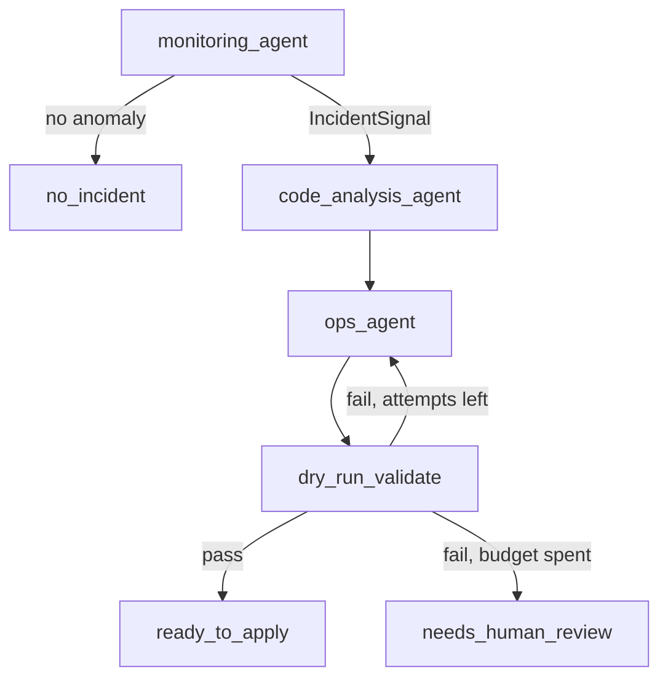

# DevOps Swarm

A three-agent LangGraph pipeline that triages a service incident end-to-end:

1. **Monitoring Agent** — queries Prometheus, detects error-ratio spikes with a
   rolling-window z-score, writes an `IncidentSignal` into shared state.
2. **Code Analysis Agent** — reads `IncidentSignal.start_timestamp` from that
   shared state, pulls commits in a `-60/+5 min` window (GitHub API or fixture
   replay), ranks them with an explicit heuristic.
3. **Ops Agent** — synthesizes both prior outputs into a `ProposedFix` via
   Anthropic tool calling (or a deterministic planner when no API key is set).
4. **Dry-run gate** — applies the fix inside a throwaway Docker container,
   hits `/healthz` + `/checkout`, and records a real `DryRunResult`. Pass →
   `ready_to_apply`. Fail with no repair budget left → `needs_human_review`
   (never an infinite auto-retry loop).

See [`AUDIT.md`](AUDIT.md) for what the previous FORGE codebase did and did
not implement relative to these claims.

## Honest scope

**Benchmark scenarios, not production-deployed.** Metric series and commit
histories used by the harness are seeded fixtures. The Prometheus *query path*
is real HTTP against `/api/v1/query_range` (or an in-process OpenMetrics replay
when `--offline` is set). Nothing here pages oncall or mutates a live cluster.
Applying a `ready_to_apply` fix is left to a human.

## Quick start

```bash
python3 -m venv .venv
source .venv/bin/activate
pip install -e ".[dev]"

# regenerate seeded fixtures
make fixtures

# end-to-end offline run (no Docker/Prometheus required for metrics;
# Docker IS required for the dry-run sandbox)
swarm run --scenario payment_timeout --offline --skip-llm --max-repair-attempts 0
```

### Live Prometheus (optional)

```bash
docker compose up -d --build
python -m benchmark.seed_prometheus --scenario payment_timeout
swarm run --scenario payment_timeout --skip-llm --max-repair-attempts 0
```

### Connect to a real service

This is separate from the fixture Quick Start above. It points the **same**
LangGraph at your Prometheus, GitHub repo, and Dockerfile via `config.yaml`.

1. Run `swarm init` and answer each prompt (every step shows real output).
2. When it asks for your Prometheus error query, discover metric names first:
   ```bash
   curl http://<your-prometheus>:9090/api/v1/label/__name__/values
   ```
3. When it asks for GitHub, create a fine-grained or classic token with **repo
   read** scope: https://github.com/settings/tokens — put the token in `.env`
   as `GITHUB_TOKEN=...` (never in `config.yaml`).
4. When it asks for your Dockerfile, point it at your service’s existing
   Dockerfile and build context — no changes needed to that file.
5. Once setup validation passes:
   ```bash
   swarm run --live
   ```

Copy [`config.example.yaml`](config.example.yaml) to `config.yaml` if you prefer
to edit by hand instead of using `swarm init`.

### Dashboard

```bash
streamlit run dashboard/app.py
```

The UI tails `.swarm/runs/<run_id>.jsonl` written by the graph as nodes
execute. Status lights are driven by those events, not by `sleep()`. Both
`--offline` demo runs and `--live` runs use the same event format.

## Architecture


```mermaid
flowchart TD
    monitoring[monitoring_agent] -->|no anomaly| noIncident[no_incident]
    monitoring -->|IncidentSignal| codeAnalysis[code_analysis_agent]
    codeAnalysis --> ops[ops_agent]
    ops --> dryRun[dry_run_validate]
    dryRun -->|pass| ready[ready_to_apply]
    dryRun -->|fail, attempts left| ops
    dryRun -->|fail, budget spent| review[needs_human_review]
```

Shared state is a single Pydantic `SwarmState` (`swarm/schemas.py`). Every tool
call goes through `ToolCall` / `ToolResult` in `swarm/tools/registry.py`.

### Anomaly detection

Leading `baseline_fraction` of the series defines mean/stdev. A sample is a
breach when `z >= z_threshold` **and** `value/baseline >= min_spike_ratio`.
Defaults: `z_threshold=3.0`, `min_spike_ratio=2.0`, `baseline_fraction=0.5`.

### Commit ranking (heuristic, not ML)

```
relevance = 0.55 * proximity + 0.35 * path_overlap + 0.10 * config_touch
```

### Dry-run failure behavior

1. Copy `sandbox/target_service` into a temp dir.
2. Apply `ProposedFix` actions (`env_override` / `file_replace`).
3. `docker build` + `docker run` on an ephemeral port.
4. Assert `/healthz == 200` and `POST /checkout == 200`.
5. Tear down the container and image.
6. If checks fail: append `DryRunResult` with logs, and either re-enter Ops
   (while `repair_attempts < max_repair_attempts`) or route to
   `needs_human_review` with the rejection reason attached.

If Docker is not reachable the dry-run fails loudly (`rejection_reason=
docker_unavailable`) rather than returning a fake pass.

## Benchmark

```bash
python -m benchmark.benchmark --offline
# → benchmark/benchmark_results.json
# → benchmark/benchmark_results.md
```

Manual triage baselines are documented per-step estimates in
[`benchmark/baseline_methodology.md`](benchmark/baseline_methodology.md).
The reduction percentage in the report is recomputed from measured swarm
wall-clock each run — it is not a hardcoded README claim.

Latest harness run (`benchmark/benchmark_results.md`, offline fixtures +
warm Docker cache): **~99.8% average reduction** (≈860s manual baseline →
≈1.5s swarm). That number will move if you re-run with a cold Docker cache
or `--live-prometheus`; cite whatever `benchmark_results.md` currently
shows, not a remembered figure.

## Configuration

```bash
cp .env.example .env
# ANTHROPIC_API_KEY=...   # optional; enables Claude for Ops
# GITHUB_TOKEN=...        # optional; enables --commit-source live
# PROMETHEUS_URL=http://localhost:9090
```

## Tests

```bash
make test
```

Covers anomaly math, commit scoring, tool registry validation, Ops heuristic
planning, and graph routing into `no_incident` / `ready_to_apply` /
`needs_human_review`.

## Layout

```
swarm/           agents, tools, graph, dry-run, CLI
sandbox/         target_service the dry-run boots
benchmark/       scenarios, fixtures, harness, baseline methodology
dashboard/       Streamlit live pipeline view
infrastructure/  Prometheus config
AUDIT.md         pre-rebuild findings
```
